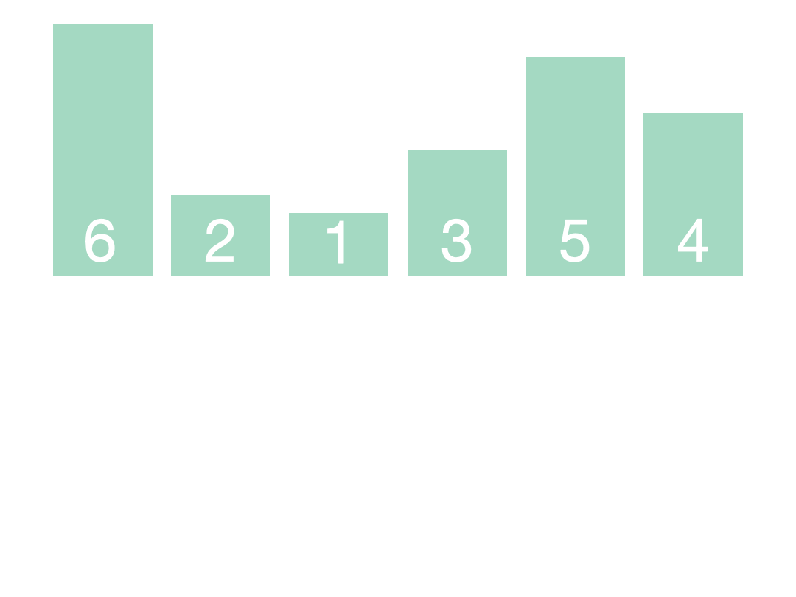

# 归并排序



### 时间复杂度

归并排序的复杂度比较容易分析，拆分数组的过程中，会将数组拆分 logn 次，每层执行的比较次数都约等于 n 次，所以时间复杂度是 O\(nlogn\)O\(nlogn\)。

### 算法思路

* 我们可以把数组不断地拆成两份，直到只剩下一个数字时，这一个数字组成的数组我们就可以认为它是有序的。
* 通过合并两个有序的列表的思路，通过回溯的方法将之前拆分的两个数组进行排序，直到整个数组排序完成。


```cpp
template<typename Iterator, typename CompareType=std::less<typename std::iterator_traits<Iterator>::value_tpye>>
void Merge(const Iterator begin, const Iterator end, const Iterator middle, CompareType compare= CompareType())
{
    using value_type = typename std::iterator_traits<Iterator>::value_type;// 迭代器指向对象的值类型
    if(std::distance(begin, middle)<=0 || std::distance(middle, end) <= 0) return;
    std::vector<value_type> result(begin,end); //暂存结果

    auto current=result.begin();
    auto left_current=begin; //左侧序列当前比较位置
    auto right_current=middle;//右序列当前比较位置 

    while(left_current != middle && right_current != end){
        if(compare(*left_current, *right_current)){
            *current++ = *left_current++;
        }else{
            *current++ = *right_current++;
        }
    }

    if(left_current != middle){  //将剩余的数组添加到尾部
        std::copy(left_current, middle, current);
    }

    if(right_current != end){ //将剩余数组添加到尾部
        std::copy(right_current, end, current);
    }

    std::copy(result.begin(), result.end(), begin); //刷新结果
}

template<typename Iterator,typename CompareType=std::less<typename std::iterator_traits<Iterator>::value_type>>
void MergeSort(const Iterator begin,const Iterator end,CompareType compare=CompareType())
{
    auto size=std::distance(begin,end);
    if(size<=1) return;
    
    Iterator middle=begin+size/2;    //将两个数组分为左右两部分
    MergeSort(begin,middle,compare); 
    MergeSort(middle,end,compare);
    Merge(begin,end,middle,compare);
    
}
```

